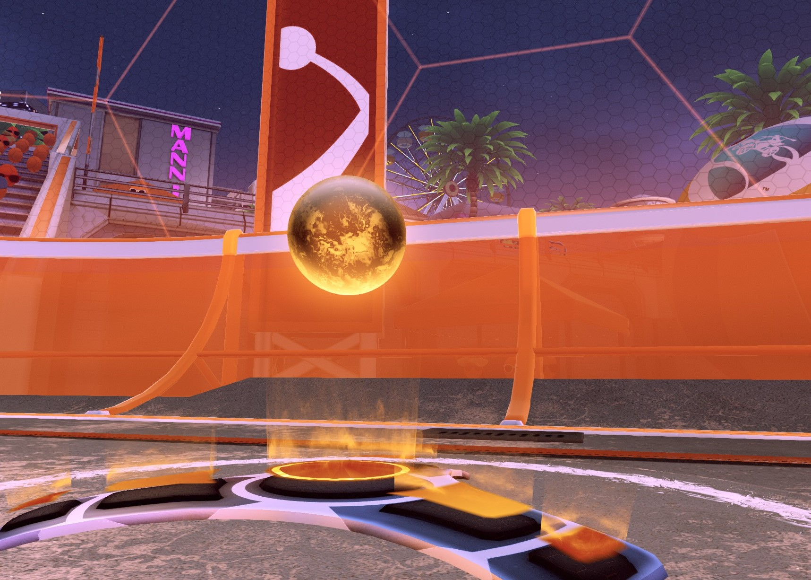

> Oh so much to be written about boost control and how it affects risk/reward, positioning, micro-positioning, pathing, rotation timing, and more. Maybe I’ll write my thoughts on it down one day.... 

## Call out boost grabs

Calling out boost information - what you steal, if the other team is starved, when/where you grab boost - is more helpful than you may realize. For example, calling the back boost can help your teammates passively determine the timing of when that boost will be back (10 seconds later), and they may adjust their rotations or pathing accordingly.

Next, glance up at the time left when you grab a big boost. It's easy to mentally count down 10 seconds and know when it will pop back up. Do this consciously in order to eventually develop your game sense to include boost spawns.

Also, glance at the clock during kickoffs. 10-13 seconds after kickoff, the boost that was grabbed during kickoff will pop back up.

## Steal the Little Pads

It's worthwhile to steal the 12 boost pads in front of the opponents net while you are applying pressure. Often picking up 12 or 24 boost while in net is what allows a player to make a goal-line save. Those pads are the most valuble to a defending team.

## It's Risky to Double-Boost grab on Kickoff

Double-boost grab leave you in a sticky situation if you lose posession after the kickoff. You are likely to lose posession, without doing a backwards-win kickoff, the other team will be closer to the kickoff ball most of the time. You'll use boost getting into posession, and if you lose another challenge, you area half-starved with no big boost pads to get for 10 seconds.

Don't do it without reason to take the risk.

## Win Boost Races when you can

You and an opponent race to the boost - do your best to win it. An opponent pathing out of their way to get boost, and not getting it, is putting them extra out of position. If you are in a race to the boost, and it's not likely you will win it, give up and path over small pads, and don't forfeit your position.

 

[Back to Home](index.md) 

