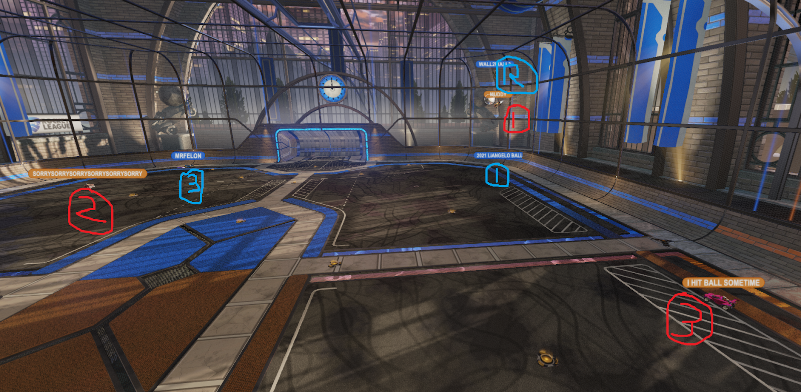
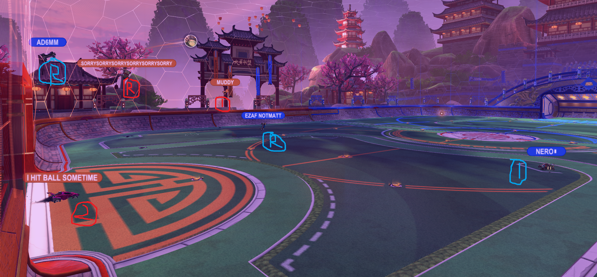
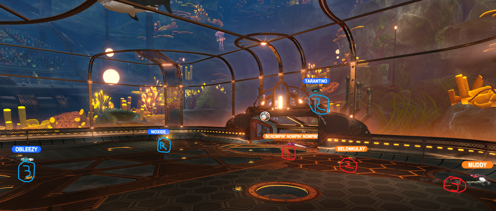

# Positioning

> I will describe players "A,B,C" in plays, which will be the players in position 1, 2, and 3 at the beginning of the described play.

## Positions: 1st, 2nd, 3rd, and Recovering

The first/second/third positions are a simple way to communicate and model (think about) responsibilities. 

> There are plays and situations where this model is not helpful. In these cases, don't use it. This is a general-use way to understand rotations and constantly-shifting responsibilities. This is not "how things work", but "a way to help you understand".

One’s **position** will change constantly throughout a game, one could go from position 1 to 2 to 3 in a matter of seconds. It helps you answer the questions “Where should I be?” and “what should I be doing?” at any given moment, as a team. These positions are a way of thinking about and communicating the game, but “learning rotations” isn’t the law of the land.

Your **responsibilities** are different depending on whether or not your team  has possession. Possession is when your team has the majority of control over what happens next: They have options. Usually **possession** means you have a teammate who will beat the other team to the ball, or is at  least in a favorable challenge position. 

## The Short Version

You can think of yourself as being in one of four roles, or responsibilities, at any given time. We call them positions 1, 2, and 3, and recovery. “Recovering” is what it means: when you are not filling any role, but trying to get back “in rotation”. 

#### On Offense

When you have possession (“On  Offense”), count the number of teammates between you and the ball. 

- Closest to the ball is position 1.
- Supporting them up is position 2
- Watching both teammates is position 3.

#### On Defense

When you don’t have possession (“On Defense”), count the number of teammates between you and your net.

- 2 teammate behind you: position 1
- 1 teammate behind you: position 2
- 0, when there is nobody teammate behind you to save a shot, is position 3. 

Either way you consider it, 1 is usually further forward, and 3 is usually further back. 

1st is the first person to touch the ball next for one's team, while second is in a position to follow up and go next, after the person in position 1 makes a play.

<iframe width="560" height="315" src="https://www.youtube.com/embed/h6dhwDfw8Jw" title="YouTube video player" frameborder="0" allow="accelerometer; autoplay; clipboard-write; encrypted-media; gyroscope; picture-in-picture" allowfullscreen></iframe> 

---

## The Longer Version

### On Offense

Your position is basically the number of  teammates between you and the ball. Here “between” means time-to-hit,  not as-the-crow-flies distance.

- 1st position, you are next to make a play.
  - ex: Shooting, passing, challenging, shadowing, fake challenge, etc

- 2nd, next after 1’s play.
  - ex: position to receive a pass, play where the 50 goes, cheat for a  kickoff, lurk around midfield for a backboard read or infield pass,  tightly follow 1st who is getting demo'd.
  - Standard offense is that 2nd is in position for when the 1st person player  succeeds, and has boost to recover or make the next play.

- 3rd: You are in position to replace whoever leaves the play first
  - Standard rotations: You will replace who was 2nd while 2nd becomes 1st.
  - Covering a majority of the field if player 1 fails their play, like losing a challenge.
  - ex: Ready for a high pop or to take a midfield challenge if it goes over  position 2 (in aggressive play), ready for other teams’ clear or  counterattack (in defensive play).
  - This position has the best vision of the field and of the opponents.
  - You should be communicating what is happening on a macro level from this  position. Ex. They are demoing, they are flying, mid boost is open  ‘bob’, watch out for waterfall

### On Defense

Position # Refers to the number of teammates behind  you, where behind you is your net, and in front of you is where the  other team is likely to play the ball.

- 1st Position is directly dismantling the other teams play. You have teammates behind you to support you if things go wrong. 
  - ex: Challenge. Intercept a pass. Fake challenge to force opponents move.  Shadow defense to reduce options into a less-threatening situation.  After attacking, or dislodging the ball, be aware of potential outlet  passes from your teammates to begin counter attack.
  - Might not be the closest to the ball, just the one in the best position to make the play. Especially in awkward corner plays.

- 2nd position: You are in position to follow up on what happens next on the  play... split that with covering the opponents likely plays. You are  supporting one teammate, and another is covering you if things go  poorly.
  - If the opponent has options, you are covering the less likely or  further-back option (without taking yourself out of the play), like  covering the far-side pass.
  - If they don’t have options, you are covering where the ball will go next.
  - You may have to abandon following up on 1’s challenge if it means covering the backboard or passing lane.
  - ex: Intercepting passes, flying after 50's, on the backboard. At front post with a teammate in the corner. On the backboard if the opponents are  going up the wall. If pos1 has a good clear, you cheat forward to chase  it down or receive an outlet pass (aggressive), or you cycle over pads  and cover the opponents setup options (backboard, aerial challenge)  (defensive).
- 3rd position: You are ready for if the other team beats position 1 and 2 in their challenge(s). You have nobody behind you, they are either in positions 1, 2, or recovering. You are the last line of defense. 
  - Generally, you are in the net
    - The backpost of the net during side-side or corner play, sometimes front post.
    - Midway deep in the net for reactive saves to opponents aerials
    - Possible lurk to front post with a teammate above you on the backboard (aggressive).
    - You might jump to 1st position when the ball goes side-side, depending on recovery/momentum of teammates
    - Position 3 sometimes has brief moments between enemy attacks  where the ball is still in the other team's control, but not instantly  threatening. It can be worth it to make a small trip to 1 or 2 boost  pads *(not the big boost in the corner, dingus).*

Defense involves cutting rotations a lot more than when on offense. For example, if the ball lobs above your net, who should play  it? Well... who has the best look at it? Probably a player coming from the side, or blackboard, and not one who is ‘closest’ and in the net. Communication is especially important on defense for this reason. When we  compliment each other for “good defensive rotations” we mean “good job staying spread out, handling the chaos, communicating what’s going on, and covering each other”. 

In defense, the spacing is more important than the sequence of rotations.

##### Example 1

***Offense:**  Muddy is trying to play the ball across, where SorrySorrySorry is waiting (aggressively) for a possible pass or center. SorrySorrySorry is very wide in order to keeps his area of influence towards where the ball will go, which may be high up in the air, and he will need room to fly to it. I  Hit Ball Sometime is in third position, ready for if the blue player beats muddy to the ball (to jump to position 1), and ready to move forward as Muddy recovers.*

***On Defense:** Wall2Wall just had a weak challenge on the ball, but it was enough to prevent Muddy from getting a good pass. They are basically out of the play until they recover. They don’t really have a 1,2,3 position, but are 'recovering'. Liangelo was rotating back along the right side before this play started, and  was in position 3, but after the ball drops down in front of them, finds themselves in position 1. MrFelon is covering the net better than Liangardo, so that makes him position 3 - the last line of defense. But where the ball drops down MrFelon has the easiest clear. In the next few moments, he double-commits with Liangelo since it’s not obvious to either of them who should go next - their positions are unclear. MrFelon has the better play on the ball, but Liangardo thinks the next touch is his responsibility. This ambiguity can be solved through communication... or through liangelo rotating around the play instead of through/underneath it.*

##### Example 2

***On Defense:** SorrySorrySorry just got a backboard clear up to Muddy, beating AD6MM in the corner. SorrySorrySorry is now recovering. Muddy, who was recovering, see's the clear coming and (aggressively) stayed/turned up field to receive this pass. They went from position 2 and are, in this moment, position 1. I Hit Ball Sometime was 3, in net on defense, and will now move to position 2 on offense. SorrySorrySorry will recover behind I Hit Ball Sometime and take position 3 well before this ball becomes a threat to orange, so I Hit Ball Sometime can start think in terms of offense, not defense, and move forward to position 2: Probably center, on Muddy’s wing, to be an option for a pass.*

***On Offense:** AD6MM is recovering after a challenge. Flipping into a challenge high on the opponents backboard without much boost, they will not get back to support their teammates very soon. NotMatt pushed forward (was position 2), but got caught by surprise by the clear. They are either recovering as the ball  goes over their head, or in position 1 if they can recover fast enough. (Spoiler, they don’t). Nero is now the only player who has a reasonable play on the ball. This makes them position 1. Being position 1 does not mean one has to go challenge the ball. In this situation, Nero should be patient and shadow, driving back with Muddy and I Hit Ball Sometime to try to limit their options and buy time. Nero’s goal is not to destroy Orange’s offensive drive completely, nor even take possession back, but to safely buy as much time as they can to let their teammates recover.*

*The next few seconds of this play, Muddy whiffs on the wall and I Hit Ball Sometime takes over and gets a shot opportunity. Muddy recovers - instantly into position 2 - and orange team is able to keep pressure. The whiff goes unpunished by blue because blue was still recovering. In other words, Orange was able to fail at a low-risk high-reward passing play without fear of getting punished by blue. They score a few rotations later on the push that results from this clear.*

##### Example 3

*Tarantino and Muddy just had an aerial challenge above the orange net, and Tarantino won it hard. Muddy Boosts down into the corner boost, and is recovering into position 3. The ball is dropping right in front of the net. This is dangerous for orange. Fortunately for Orange, Scrompin’ Nompin’ Nompin’ is in net and ready, having previously been in position 3 while Muddy challenged and Belonkulay had directed his momentum to where he had expected the challenge to go (as position 2, was creeping towards the corner with too much faith in muddy). This challenge win by Tarantino that beat both Muddy and Belonkulay, and left the ball in a threatening position. This is an advantageous position for blue, the biggest mistake simply being Belonkulay putting a bit too much faith in the challenge win.*

*Seeing this advantage, and the ball dropping in front of the net, and seeing both teammates recovering from the previous play, Obleezy notices they are in position 1 (if blue were still in possession of the ball). Obleeze can’t let this chance go, its too good. Obleeze decides to boost forward andshoot the  ball, or at least 50/50 Scrompin’ Nompin'. Position 1 on offense is the number of players between you and the ball, which for Obleezy, is none. He is the next blue player who can play on it.* 

*Unfortunately, his defensive position is 3 - he has nobody behind him in support. His teammates are both still recovering. His position might be considered 1 or 3, thinking in terms of offense or defense. Either way he should recognize he could be beaten to the ball  by Scrompin'. Eager to capitalize on the opportunity, Obleezy makes a decision that has a wild risk, and scrompin’ launches the ball over Obleezy’s head into the open net.*

*Obleezy was thinking in terms of offense, not defense. Or regardless of  positions, they needed to recognize that despite the advantageous position of the ball, the risk of going for the goal was far too great  to be worth it.*

In **example 3**, we notice that there was - for Obleezy - a discrepancy between the 'offensive' position and the 'defensive' position. This means that blue's rotations are "off". Everyone has both offensive responsibilities and defensive responsibilities, and in this case they disagreed extremely. Such a discrepancy is a moment to pay attention to. If you err on the side of offensive responsibility, you are playing aggressive. If you err on the side of defensive responsibility, you are playing defensive. You can shift between offensive and defensive play as a game or series develops.

---

## Transitioning

### In Transition, Defense-To-Offense

In a defensive defense-to-offense transition, position 1 goes and looks for a good challenge or touch before 2 & 3 then moves to more aggressive positioning. Positions 2 & 3 wait for the challenge before moving forward. 

> You’ve all seen it: Somebody creeps out of net in anticipation of a good  challenge along the wall, the ball 50’s loose to an opponent, and they score easily. Or, you start a counterattack only to get dunked on the  first touch and suddenly, instantly, got counter-counterattacked. AKA  “wrecked lol”.

In aggressive defense-to-offense transition, player 1 and 2 both move forward for that good first touch/challenge/pass and player 3 covers. ex: the outlet play.

### In Transition, Offense-To-Defense

Offense-to-defense transition is more difficult to describe. I should make gifs or diagrams. Sorry.

The big decision-making question is: Where are the off-ball or recovering players the most useful? How can you, off the ball, be useful? This is, most of the time, quickly getting back, boosting up, and “freeing” your teammates (from defensive responsibilities) to then move forward and make good challenges. Recovering fast is almost always the right play. Even if it feels you’re being useless.

#### Recovering Player

Can recently-position 1 get a demo or boost steal on the rotation back? Do they need to just hustle back as fast as possible? Do they slowly retreat, and remain an option for a quick counterattack (such as a cherry pick), How can they path over boost pads  on their way back? Do they cut into the other team, and tackle them while driving the same way (interference, demo, trip up, go straight into shadow defense, force a possession turnover to teammate).

#### Position 1

The question is how aggressive to challenge while your teammates recover. Full challenge? (suddenly: we aren't transitioning to defense) or aggressive dunk (remember to yell "I BELIEVE"). A fake challenge can make the opponent pop the ball, or clear it to you, making it a less risky position to be in. If your teammates are back, forcing the offense to make an early move/dump the ball is a great way to get possession back. Shadow defense is also a great plan: it's like a slow fake-challenge, you are slowly forcing the opponent into your corner or the wall, away from shooting or passing.

Give the other team only 1 best option, and don't make it a good one.

The biggest point for position 1 against the opponents counter-attack is that in most non-aggressive situations (without both teammates back and boosted), you cannot throw yourself through a big challenge. Just a single-jump or no-jump challenge, fake challenge, shadow, or even just cycling out (maybe to grab boost and bump) if your position isn't helpful. 

Drive up to the opponents to make them make a play, but probably don't jump and flip through them if your teammates are still recovering.

#### Position 2

You likely just became position 1, or were just position 3. Is ex-1 still recovering? That makes you still position 3. Will they be back in time? Or are you aggressive? Time to support your teammate.

#### Position 3

It’s retreat, grab boost if you can - and don’t assume you can. You're setting yourself up to be able to play next.