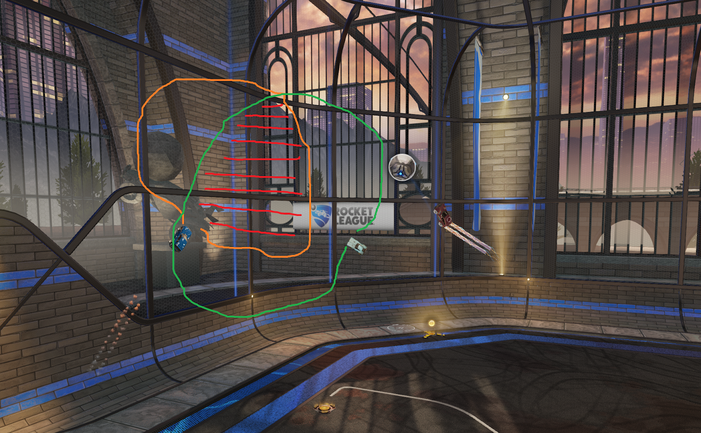

Spacing

[Back To Home](index.md)

Imagine every single location your car  can get to in 1 second.  From a stand still, it would look like a big  cone in front and above you, and a smaller one behind you. This is the  area you can be useful in the next 2 seconds. Let’s call it your area of influence. The faster you are moving, the larger this area is. 

Keeping this area large (i.e.: having more options and being able to make a  wider variety of plays) is why momentum is so important in Rocket  League.

Spacing is minimizing the overlap of a teams  area-of-influence’s. Basically: Spread out, and don’t be pointed at the  same thing. Stay away from each other. When you are near each other, you are probably going different speeds and/or different directions. 

*Spacing is minimizing the overlap of a teams  area-of-influence’s. Basically: Spread out, and don’t be pointed at the  same thing. Stay away from each other. When you are near each other, you are probably going different speeds and/or different directions.*

